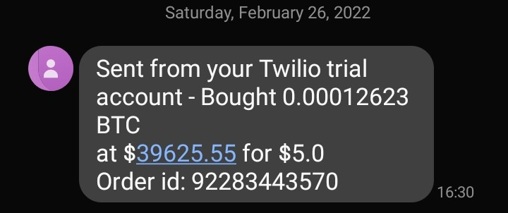
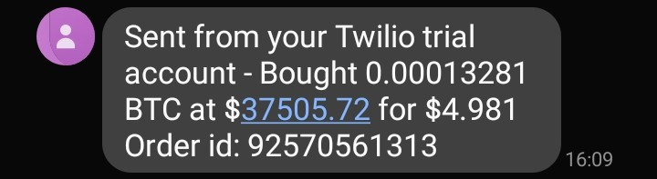

Here's something I made to automate my DCA'ing (Dollar Cost Averaging) on the Gemini exchange using their API. To get
something like this to work, you must first have recurring deposits on for GUSD (this is done in the Gemini App). After
the deposit clears, you can either sell the GUSD for USD (no fees) and buy whichever crypto you want, or exchange GUSD for
BTC or ETH (there is less liquidity with those pairs, but ultimately won't make a difference for this purpose).

I took the extra step to add a lambda function and host this on AWS running on a cron job. Since I have recurring 
deposits set for every Saturday at 4:00 pm, I have the program set to execute at 4:30 (just to provide a buffer in case there's
any latency issues on the exchange's end, although 30 minutes may be excessive). Once the trade goes though, I'll get a text
with the relevant information.

Below are some screenshots of text confirmations: 

I then made a few tweaks to make it look a bit cleaner: 

It's a little bit of joke at this point to say this, but in no way am I offering financial advice to use my script or to 
buy any given crypto or follow this strategy. If you do choose to do something like this, bear in mind all trades done through 
the API are limit trades, and follow the limit trade schedule. For example, for every $5 GUSD I buy, I am charged a .02 fee. 